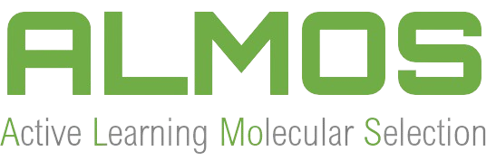

<p align="center">
  
</p>

<h2 align="center">ALMOS</h2>
<p align="center"><strong>Active Learning Molecular Selection</strong></p>

<p align="center">
  <a href="https://app.circleci.com/pipelines/github/MiguelMartzFdez/almos"></a>
  <a href="https://codecov.io/gh/MiguelMartzFdez/almos"></a>
  <a href="https://pepy.tech/project/almos-kit"></a>
  <a href="https://almos.readthedocs.io/"></a>
  <a href="https://pypi.org/project/almos-kit/"></a>
</p>

---

## Install ALMOS

### Option 1: EasyALMOS desktop installers

The easiest way to use ALMOS is through the **EasyALMOS** desktop application. No Python, Conda, or terminal setup is required.

<p align="center">
  <a href="https://github.com/MiguelMartzFdez/almos/releases/latest"><strong>Download EasyALMOS from GitHub Releases</strong></a>
</p>

| Platform | File to download | How to open |
| --- | --- | --- |
| Windows | `easyalmos-<VERSION>.exe` | Double-click the installer, then open **EasyALMOS** from the Start Menu or Windows Search. |
| macOS | `easyalmos-<VERSION>.dmg` | Open the disk image, drag **EasyALMOS.app** to Applications, then open the app. |
| Ubuntu / Debian Linux | `easyalmos-<VERSION>.deb` | Double-click the package or install it with `sudo apt install ./easyalmos-<VERSION>.deb`. |

These installers create a private ALMOS runtime and keep it isolated from your system Python or Conda installations. The first installation may take a few minutes while the environment is prepared.

For detailed installer instructions, see the release notes in [GitHub Releases](https://github.com/MiguelMartzFdez/almos/releases).

### Option 2: Recommended Conda and pip installation

Use this option if you already work with Python environments.

1. Create a new Conda environment:

   ```bash
   conda create -n almos python=3.11
   ```

2. Activate the environment:

   ```bash
   conda activate almos
   ```

3. Install ALMOS:

   ```bash
   pip install almos-kit
   ```

4. Install libraries required by the ROBERT backend:

   ```bash
   conda install -y -c conda-forge glib gtk3 pango mscorefonts
   ```

5. Only for AQME workflow uses, install AQME external dependencies:

   ```bash
   conda install -y -c conda-forge openbabel=3.1.1 xtb=6.7.1
   ```

6. Optional, only for compatible devices, install the Intel accelerator:

   ```bash
   pip install scikit-learn-intelex==2025.2.0
   ```

Users with no Python experience should start with the EasyALMOS installers above or visit the *Users with no Python experience* section in [Read the Docs](https://almos.readthedocs.io).

### Option 3: Conda environment file

You can install ALMOS and its required dependencies from the provided Conda environment file.

1. Open a terminal, or Anaconda Prompt on Windows.

2. Go to the folder where you want to save the environment file:

   ```bash
   cd path/to/download/folder
   ```

3. Download the Conda environment file:

   ```bash
   curl -O https://raw.githubusercontent.com/MiguelMartzFdez/almos/miguel/install/almos.yaml
   ```

4. Create the Conda environment:

   ```bash
   conda env create -f almos.yaml
   ```

5. Activate the environment:

   ```bash
   conda activate almos
   ```

## Launch

After installing with pip or the Conda environment file, use:

```bash
almos
```

To open the graphical interface:

```bash
easyalmos
```

## Update

For pip-based installations:

```bash
pip install almos-kit --upgrade
```

For EasyALMOS desktop installers, download the latest installer from [GitHub Releases](https://github.com/MiguelMartzFdez/almos/releases/latest).

## Documentation

Full documentation is available at [almos.readthedocs.io](https://almos.readthedocs.io/).

## Developers and Help Desk

List of main developers and contact emails:

- [Miguel Martinez Fernandez](https://orcid.org/0009-0002-8538-7250). Contact [miguel.martinez@csic.es](mailto:miguel.martinez@csic.es)
- [Susana P. Garcia Abellan](https://orcid.org/0000-0002-3138-5527). Contact [sg.abellan@csic.es](mailto:sg.abellan@csic.es)
- [David Dalmau Ginesta](https://orcid.org/0000-0002-2506-6546). Contact [ddalmau@unizar.es](mailto:ddalmau@unizar.es)
- [Juan V. Alegre-Requena](https://orcid.org/0000-0002-0769-7168). Contact [jv.alegre@csic.es](mailto:jv.alegre@csic.es)

For suggestions and improvements, please use GitHub issues and pull requests.

## License

ALMOS is freely available under an [MIT](https://opensource.org/licenses/MIT) License.
