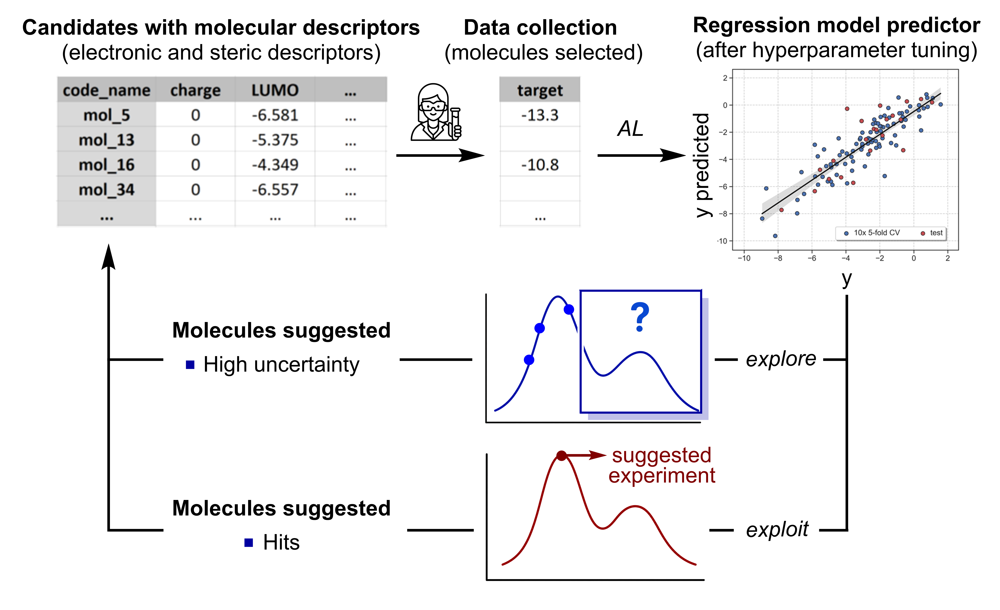

.. al-modules-start

Active Learning (AL)
--------------------

Overview
+++++++++

**Active Learning module for building predictive and interpretable models**

.. centered:: |al_fig|

When the goal is to build a predictive and interpretable model, ALMOS incorporates
an active learning strategy designed to improve model performance through informed
data acquisition. The current implementation uses ROBERT to train and evaluate the
predictive model at each iteration, then ranks unlabeled points according to the
selected active learning strategy.

The AL module supports three practical operating modes:

* **Auto mode**: ALMOS decides whether the next batch should prioritize model
  improvement or hit-seeking based on the current ROBERT model score.
* **Model mode**: ALMOS ranks unlabeled candidates only by predictive uncertainty
  and selects the highest-uncertainty points.
* **Hit mode**: ALMOS ranks candidates using a confidence-bound acquisition
  function. For maximization it uses an upper confidence bound (UCB), and for
  minimization it uses a lower confidence bound (LCB).

How AL works
++++++++++++++

The AL workflow is currently:

* **Retrain the model** with the currently labeled rows.
* **Generate predictions** and predictive uncertainty for the unlabeled rows.
* **Choose a strategy**:
  
  * in ``auto``, from the ROBERT score;
  * in ``--mode model``, by pure uncertainty;
  * in ``--mode hit``, by ``objective`` and optional ``alpha``.

* **Select the next batch** of size ``--n_exps``.
* **Write the new batch CSV** and log convergence / model-quality information.

The AL module requires a curated CSV file containing:

- Molecular descriptors (numerical input features).
- A target property column.
- A batch column indicating which datapoints are already labeled (for example,
  ``batch = 0`` from CLUSTER and later experimental rounds).

Example usage:

.. code-block:: shell

   al --csv_name EXAMPLE.csv --y Y_VALUE --name code_name --n_exps 10
   al --csv_name EXAMPLE.csv --y Y_VALUE --name code_name --n_exps 10 --mode model
   al --csv_name EXAMPLE.csv --y Y_VALUE --name code_name --n_exps 10 --mode hit --objective max --alpha 0.5

Main parameters
+++++++++++++++

The most commonly used options in the current AL workflow are:

* ``--csv_name``: input CSV for the active learning cycle.
* ``--name``: identifier column used to report which candidates are selected.
* ``--y``: target property to model.
* ``--n_exps``: number of unlabeled candidates suggested for the next batch.
* ``--ignore``: columns that should not be used as descriptors. Typical examples are
  ``batch``, identifiers or textual metadata columns.
* ``--mode``: active learning mode. The available user-facing choices are:

  * ``auto``: ALMOS decides the strategy from the current ROBERT score.
  * ``model``: select candidates only by predictive uncertainty.
  * ``hit``: select candidates using a confidence-bound acquisition function.

* ``--objective``: only used in ``hit`` mode.

  * ``max``: ranks candidates using an upper confidence bound (UCB), suitable when
    the goal is to maximize the target.
  * ``min``: ranks candidates using a lower confidence bound (LCB), suitable when
    the goal is to minimize the target.

* ``--alpha``: only used in ``hit`` mode. This controls the weight of predictive
  uncertainty in the acquisition score. Larger values place more emphasis on
  exploration, while smaller values favor exploitation of the predicted optimum.

Typical command-line patterns:

.. code-block:: shell

   al --csv_name EXAMPLE.csv --y Y_VALUE --name code_name --n_exps 10
   al --csv_name EXAMPLE.csv --y Y_VALUE --name code_name --n_exps 10 --mode model
   al --csv_name EXAMPLE.csv --y Y_VALUE --name code_name --n_exps 10 --mode hit --objective max
   al --csv_name EXAMPLE.csv --y Y_VALUE --name code_name --n_exps 10 --mode hit --objective min --alpha 0.5

AL Protocol in ALMOS
+++++++++++++++++++++++

1. The user supplies a CSV file with molecular descriptors, a target column and
   at least one labeled batch.
2. ALMOS retrains a ROBERT model on the labeled rows.
3. The model predicts values and uncertainty for all unlabeled datapoints.
4. ALMOS resolves the active learning strategy:

   * ``auto`` based on model score,
   * ``model`` for uncertainty-only selection,
   * ``hit`` for UCB / LCB ranking.

5. The selected datapoints become the next suggested experimental batch.

Important options
+++++++++++++++++

* ``--mode model``: force model-improvement selection by highest uncertainty
* ``--mode hit``: force hit-seeking selection
* ``--objective max``: use UCB-style ranking
* ``--objective min``: use LCB-style ranking
* ``--alpha``: confidence-bound weight used only in hit mode
* ``--n_exps``: number of points suggested for the next batch

Reference
+++++++++

- ROBERT: https://github.com/jvalegre/robert (*Wiley Interdisciplinary Reviews: Computational Molecular Science* **2024**, *14*, e1733.)
  Dalmau, D.; Alegre Requena, J. V. ROBERT: Bridging the Gap between Machine Learning and Chemistry.

Example
+++++++

An example is available in **Examples/Use of individual modules**.

.. al-modules-end
