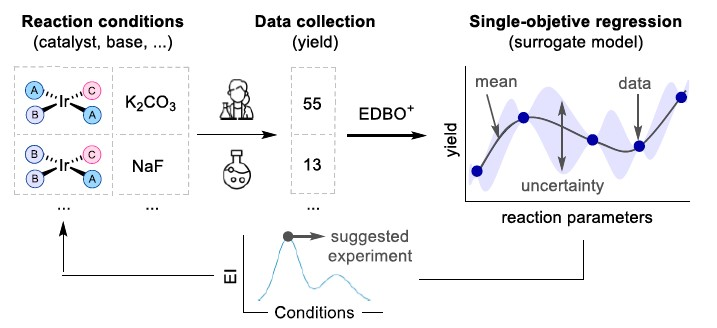

.. bo-modules-start

Bayesian Optimization (BO)
--------------------------

Overview
++++++++

Bayesian Optimization (BO) is a powerful strategy for efficiently searching high-dimensional parameter spaces, commonly used to optimize experimental conditions in chemistry and related fields.

.. centered:: |bo_fig|

How Bayesian Optimization Works
+++++++++++++++++++++++++++++++

BO builds a probabilistic model—typically a Gaussian Process—using all available experimental data. This model predicts both the expected outcome and the uncertainty for each untested condition. An acquisition function, such as Expected Improvement (EI), then evaluates all candidate points, balancing:

- **Exploration**: Sampling where the model is uncertain, to learn more about the space.
- **Exploitation**: Sampling where the predicted outcome is promising, to improve results.

At each iteration, BO selects the next experiment by maximizing the acquisition function. This iterative process quickly converges to optimal conditions while minimizing the number of experiments required.

Implementation in ALMOS
+++++++++++++++++++++++

In ALMOS, BO is implemented using the EDBO+ framework, developed by Abby Doyle and collaborators. EDBO+ provides robust tools for experimental design and optimization. For more information, visit: https://github.com/doyle-lab-ucla/edboplus

Required Input
++++++++++++++

- The user must provide a CSV file containing at least one target value (the variable to optimize).
- This file should be placed inside a folder named ``batch_0`` (note: the clustering module can also generate this folder and initial data).

BO Protocol in ALMOS
++++++++++++++++++++

1. The user supplies a CSV file with at least one target value in the ``batch_0`` folder.
2. The BO module uses EDBO+ to fit a surrogate model and select new experimental conditions that maximize the acquisition function.
3. The process repeats, iteratively updating the model with new data, until optimal conditions are found or user-defined stopping criteria are met.

Reference
+++++++++

- EDBO+: https://github.com/doyle-lab-ucla/edboplus (*Journal of the American Chemical Society* **2022** 144 (43), 19999-20007.)

Example
+++++++

A practical example can be found in **Examples/Use of individual modules**.

.. bo-modules-end