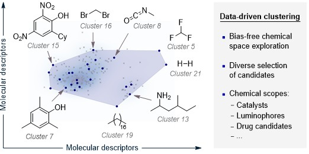

.. cluster-modules-start

Clustering (CLUSTER)
----------------------

Overview
+++++++++

**Cluster Module for Automated Chemical Space Exploration**

.. centered:: |cluster_fig|

Clustering is an unsupervised learning technique used to partition high-dimensional chemical spaces into groups of structurally or functionally similar compounds, based on molecular descriptors. Within the ALMOS framework, the clustering module enables the systematic selection of an initial, diverse set of candidate molecules to seed active learning (AL) workflows. This approach reduces human bias in the selection process and ensures representative coverage of the chemical space. It is particularly suited for scenarios where defining the scope of a molecular library is critical, as it facilitates automated, scalable, and reproducible organization of chemical diversity.

How Cluster works
+++++++++++++++++++++

The current CLUSTER workflow in ALMOS is coverage-driven. Instead of asking the user
to define a fixed number of clusters, the program:

* builds a cleaned descriptor space from the input data,
* evaluates several clustering strategies internally,
* estimates a reasonable number of representative points automatically when
  ``--n_points`` is not provided,
* and selects a diverse ``batch = 0`` seed set for downstream active learning.

The default workflow is oriented toward *representative selection*, not manual
cluster-count tuning.

Required Input
++++++++++++++++

There are two main options:

- The user can provide a CSV file containing **molecular features** (i.e., DFT properties, experimental measurements, etc.). In such cases, the '--name' option must be specified (e.g. ``--name molecules``).

.. code-block:: shell 

   cluster --input EXAMPLE.csv --name MOL_NAME

- The user can also provide a CSV file containing the **code_name** and **SMILES**
  columns. In this case, ALMOS can automatically generate the molecular features
  from SMILES strings using the ``--aqme`` option, implemented via the AQME package.
  This route is intended for users who do not already have a descriptor matrix.

.. code-block:: shell 

   cluster --input EXAMPLE.csv --name code_name --aqme

Main parameters
+++++++++++++++

The most commonly used options in the current CLUSTER workflow are:

* ``--input``: input file for clustering. This is usually a CSV containing either
  descriptors or SMILES-based inputs to be processed with AQME.
* ``--name``: identifier column used to track the selected molecules or conditions.
  This should contain unique labels for each row.
* ``--n_points``: number of representative points to select. If omitted, ALMOS
  estimates a suitable selection size automatically.
* ``--y``: optional target column used only for visual interpretation in the
  chemical-space viewer and related plots.
* ``--ignore``: columns that should not be treated as descriptors. This is useful
  for names, textual metadata or bookkeeping columns.
* ``--aqme``: enables descriptor generation from SMILES-based inputs before the
  clustering workflow starts.
* ``--evaluate``: skips reselection and evaluates an already existing ``batch = 0``
  selection in the input file. This is useful when the user wants ALMOS to analyse
  a manual or external seed set instead of creating a new one.

Typical command-line patterns:

.. code-block:: shell

   cluster --input EXAMPLE.csv --name MOL_NAME
   cluster --input EXAMPLE.csv --name MOL_NAME --n_points 40
   cluster --input EXAMPLE.csv --name MOL_NAME --ignore "[batch,SMILES]"
   cluster --input EXAMPLE.csv --name code_name --aqme
   cluster --input EXAMPLE.csv --name MOL_NAME --evaluate

CLUSTER Protocol in ALMOS
++++++++++++++++++++++++++

1. The user supplies a CSV file containing molecular descriptors, or a CSV/structure
   file that can be processed through ``--aqme``.
2. ALMOS cleans the descriptor space and evaluates clustering quality internally.
3. The program selects a representative subset of points and writes them as
   ``batch = 0`` in the output CSV.
4. ALMOS generates a chemical-space viewer, coverage diagnostics and descriptor-based
   interpretation plots to help assess how representative the selected batch is.
5. If a dataset already contains a user-defined ``batch = 0`` selection, the user can
   skip reselection and evaluate that selection directly with ``--evaluate``.

Example
+++++++

An example is available in **Examples/Use of individual modules**.

.. cluster-modules-end
