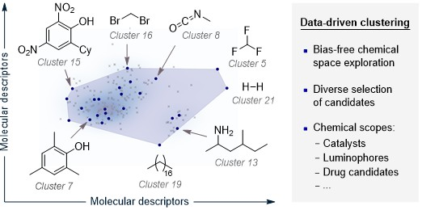

.. cluster-modules-start

Clustering (CLUSTER)
----------------------

Overview
+++++++++

**Cluster Module for Automated Chemical Space Exploration**

.. centered:: |cluster_fig|

Clustering is an unsupervised learning technique used to partition high-dimensional chemical spaces into groups of structurally or functionally similar compounds, based on molecular descriptors. Within the ALMOS framework, the clustering module enables the systematic selection of an initial, diverse set of candidate molecules to seed active learning (AL) workflows. This approach reduces human bias in the selection process and ensures representative coverage of the chemical space. It is particularly suited for scenarios where defining the scope of a molecular library is critical, as it facilitates automated, scalable, and reproducible organization of chemical diversity.

How Cluster works
+++++++++++++++++++++

The clustering module in ALMOS uses **K-means** to divide chemical data into k groups by minimizing intra-cluster variance. It initializes centroids and iteratively reassigns points based on proximity, refining the clusters until convergence into compact and distinct groupings.

The number of clusters can be defined manually using the --n_clusters option (i.e., ``--n_clusters 5``); if not specified, ALMOS estimates the optimal k automatically using the **elbow method** to best capture chemical space diversity.

Required Input
++++++++++++++++

There are two options:

- The user can provide a CSV file containing **molecular features** (i.e., DFT properties, experimental measurements, etc.). In such cases, the '--name' option must be specified (e.g. ``--name molecules``).

.. code-block:: shell 

   python -m almos --cluster --input EXAMPLE.csv --name MOL_NAME 

- The user can also provide a CSV file containing the **code_name** and **STRING columns**. In this case, ALMOS automatically generates the molecular features from SMILES strings using the ``--aqme`` command, implemented via the AQME package. This method can also be used with an SDF file.

.. code-block:: shell 

   python -m almos --cluster --input EXAMPLE.csv --name code_name --aqme

CLUSTER Protocol in ALMOS
++++++++++++++++++++++++++

1. The user supplies a CSV file containing molecular features or a CSV file containing the code_name and STRING columns and uses the ``--aqme`` command.
2. The CLUSTER module applies the K-means algorithm to partition the dataset into k clusters and selects the molecule closest to each cluster centroid, yielding the specified number of ``--n_clusters``. If this parameter is not provided, the module automatically estimates the optimal number of clusters using the elbow method.
3. ALMOS applies PCA to reduce the clustered chemical space to 3D, maximizing explained variance and enabling intuitive visualization. The total variance explained helps assess clustering quality.

Example
+++++++

An example is available in **Examples/Use of individual modules**.

.. cluster-modules-end
