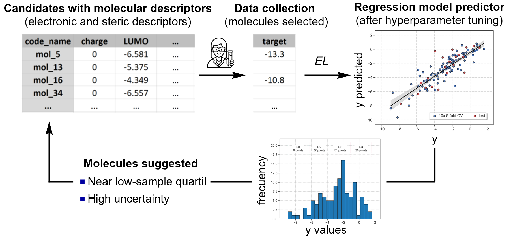

.. el-modules-start

Exploratory Learning (EL)
-------------------------

Overview
+++++++++

**Exploratory Learning Module for building predictive and interpretable models**

.. centered:: |el_fig|

When the goal is to build a predictive and interpretable model, ALMOS incorporates an exploratory learning strategy designed to improve model performance through informed data acquisition. This process starts with the training of an initial supervised model (e.g., using Random Forests, Neural Networks, or Gradient Boosting) on a small batch of labeled data. Although the initial model may have limited accuracy, it serves as the foundation for a guided learning loop that is progressively refined by selecting the most informative, unlabeled data points.

The EL module identifies regions of chemical space that are either underrepresented in the training set and associated with high predictive uncertainty. It then recommends molecules from these regions to be labeled next, ensuring that the model is continually exposed to challenging and diverse data. This strategy accelerates learning, maximizes predictive reliability, and enhances the model's ability to generalize beyond the initially labeled dataset.

EL focuses on a two-step strategy to guide model improvement:

- **Regions with sparse data coverage**, where the training set lacks representative examples.
- **Predictions with high uncertainty**, where the model shows low confidence.

By first identifying underexplored regions and then prioritizing uncertain predictions within them, the EL module ensures that each selected datapoint contributes maximally to improving model generalization and robustness.

How EL works
++++++++++++++

The EL module selects new candidate molecules based on model predictions, following a two-step strategy:

- **Prediction-based filtering**: The model first predicts values for all untested molecules in the dataset.
- **Low-density regions**: It identifies candidates located in areas of the feature space with few or no training points.
- **High uncertainty**: Within those regions, it selects molecules where the model shows the highest predictive uncertainty.

This approach ensures that selected data points help the model explore underrepresented regions while reducing uncertainty. The number of candidates is defined with the ``--n_exps`` parameter. The balance between uncertainty and density can be configured by the user.

+++++++++++++++

The EL module requires a curated CSV file containing:

- Molecular descriptors (numerical input features).
- A target property column.
- A column indicating which datapoints are already labeled (i.e., have been used in previous model training rounds or clustering module).

Example usage:

.. code-block:: shell

   python -m almos --el --csv_name EXAMPLE.csv --y Y_VALUE --name code_name --n_exps 10 

EL Protocol in ALMOS
+++++++++++++++++++++++

1. The user supplies a CSV file with molecular descriptors, at least one target value and molecules already labeled (i.e., used in previous model training rounds or clustering module). 
2. The EL module trains a regression model using ROBERT (e.g., Random Forest, Gaussian Process, or an ensemble).
3. The model predicts values and estimates uncertainty for all unlabeled datapoints.
4. Based on uncertainty, density, or a weighted combination of both, it selects the most informative molecules.
5. These selected datapoints can be used in the next active learning iteration to refine the model.

Reference
+++++++++

- ROBERT: https://github.com/jvalegre/robert (*Wiley Interdisciplinary Reviews: Computational Molecular Science* **2024**, *14*, e1733.)
  Dalmau, D.; Alegre Requena, J. V. ROBERT: Bridging the Gap between Machine Learning and Chemistry.

Example
+++++++

An example is available in **Examples/Use of individual modules**.

.. el-modules-end
