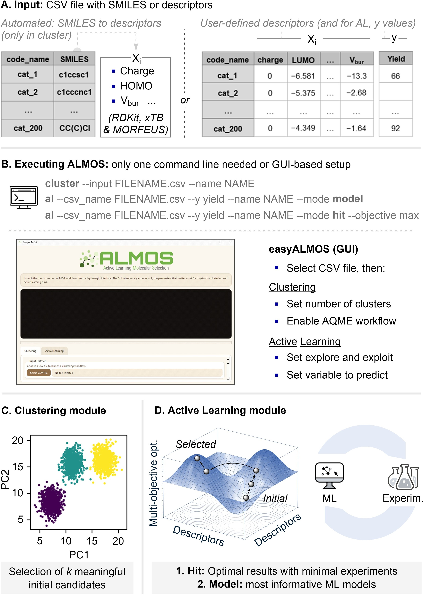

.. almos-banner-start

.. |almos_banner| image:: ../almos/icons/almos_logo.png

|almos_banner|

.. almos-banner-end

.. badges-start

.. |CircleCI| image:: https://img.shields.io/circleci/build/github/MiguelMartzFdez/almos?label=Circle%20CI&logo=circleci
   :target: https://app.circleci.com/pipelines/github/MiguelMartzFdez/almos

.. |Codecov| image:: https://img.shields.io/codecov/c/github/MiguelMartzFdez/almos?label=Codecov&logo=codecov
   :target: https://codecov.io/gh/MiguelMartzFdez/almos

.. |Downloads| image:: https://pepy.tech/badge/almos-kit
   :target: https://pepy.tech/project/almos-kit

.. |ReadtheDocs| image:: https://img.shields.io/readthedocs/almos?label=Read%20the%20Docs&logo=readthedocs
   :target: https://almos.readthedocs.io/
   :alt: Documentation Status

.. |PyPI| image:: https://img.shields.io/pypi/v/almos-kit
   :target: https://pypi.org/project/almos-kit/

|CircleCI|
|Codecov|
|Downloads|
|ReadtheDocs|
|PyPI|

.. badges-end

.. checkboxes-start

.. |check| raw:: html

    <input checked=""  type="checkbox">

.. |check_| raw:: html

    <input checked=""  disabled="" type="checkbox">

.. *  raw:: html

    <input type="checkbox">

.. |uncheck_| raw:: html

    <input disabled="" type="checkbox">

.. checkboxes-end

================================================
Active Learning Molecular Selection (ALMOS)
================================================

.. contents::
   :local:

What is ALMOS?
--------------

.. introduction-start

ALMOS is an ensemble of automated machine learning workflows designed for chemical 
discovery, which can be run sequentially through a single command line or a graphical 
user interface. The program supports tasks such as candidate selection, optimization, 
and predictive model development. Comprehensive workflows have been designed to meet 
modern standards in data-driven chemistry, including:

   *  **Clustering module**, which selects an initial, diverse, and representative subset 
      of molecules or conditions from a descriptor space. The current CLUSTER workflow 
      evaluates several clustering strategies internally and recommends a coverage-driven 
      batch of points instead of relying on a user-defined number of clusters. Input data 
      can be user-provided or automatically generated from SMILES using the AQME program. 

      *  **Atomic and molecular descriptor generation from SMILES**, including an RDKit 
         conformer sampling and the generation of 200+ steric, electronic and structural 
         descriptors using RDKit, xTB and MORFEUS. Requires the 
         `AQME program <https://aqme.readthedocs.io>`__.  

   *  **Active learning module**, which builds robust and interpretable ML models through 
      iterative retraining with ROBERT. The current AL workflow supports automatic 
      strategy selection, explicit model-improvement mode, and hit-seeking mode through 
      upper/lower confidence bound ranking. 

The code has been designed for:

   *  **Inexperienced researchers** in the field of ML. ALMOS provides intuitive workflows,
      a graphical user interface, and detailed visual outputs to facilitate the adoption
      of clustering and active learning techniques in chemical research. Minimal coding 
      is required, and complete tutorials are available to guide users through real-world 
      case studies.

   *  **Researchers and developers** seeking reproducible and efficient ML workflows. 
      ALMOS offers modular components that can be integrated into existing pipelines for 
      candidate selection, model building, or optimization, with full control over inputs
      and strategies.

Overview of ALMOS
------------------

.. centered:: |overview_almos|

.. Don't miss out the latest hands-on tutorials from our 
.. `YouTube channel <https://www.youtube.com/channel/UCHRqI8N61bYxWV9BjbUI4Xw>`_  

.. introduction-end

.. installation-start

Installation
------------

ALMOS can be installed either through a ready-to-use conda environment file or
through a more explicit manual setup.

Quick Installation with ``almos.yaml``
++++++++++++++++++++++++++++++++++++++

For a quick and reproducible installation, ALMOS provides a Conda
environment file `almos.yaml <https://github.com/MiguelMartzFdez/almos/tree/master/install>`__,
that can be used to create the recommended environment.

**1.** Open an Anaconda Prompt (Windows) or a terminal (macOS and Linux), and
navigate to the directory where you want to create the environment:

.. code-block:: shell

   cd C:/Users/test_almos

**2.** Download the environment file ``almos.yaml`` directly from GitHub:

.. code-block:: shell

   curl -L -o almos.yaml https://raw.githubusercontent.com/MiguelMartzFdez/almos/master/install/almos.yaml

**3.** Build the environment using the downloaded YAML file:

.. code-block:: shell

   conda env create -f almos.yaml

**4.** Activate the environment

.. code-block:: shell

   conda activate almos

**5.** Verify the installation

Check that the ALMOS command-line interface is available:

.. code-block:: shell

   almos help

If the installation completed successfully, the help message should be displayed.

Standard manual installation
++++++++++++++++++++++++++++

If you prefer to install the dependencies step by step, the recommended manual
installation is:

**1.** Create and activate the conda environment where you want to install the program.

   If you are not sure of what this point means, check out the "Users with no Python 
   experience" section. ALMOS currently requires Python 3.11 or newer:

.. code-block:: shell 
   
   conda create -n almos python=3.12
   conda activate almos

**2.** Install ALMOS using pip:  

.. code-block:: shell 
   
   pip install almos-kit

**3.** Install the system libraries required by the ROBERT / WeasyPrint reporting stack:

.. code-block:: shell

   conda install -y -c conda-forge glib gtk3 pango mscorefonts

**4.** Install the chemistry-related requirements used by AQME / descriptor generation:

.. code-block:: shell

   conda install -y -c conda-forge openbabel=3.1.1
   conda install -y -c conda-forge xtb=6.7.1
   conda install -y -c conda-forge libgfortran=14.2.0

ALMOS installs its Python dependencies automatically, including AQME and ROBERT, from 
the package metadata. After installation, you can check that the command line interface 
is available with:

.. code-block:: shell

   almos help

Installation of extra requirements
++++++++++++++++++++++++++++++++++++

Extra requirements if xTB or CREST are used (compatible with MacOS and Linux only):  

.. code-block:: shell 

   conda install -y -c conda-forge crest=2.12

.. warning::

  Due to an update in the libgfortran library, **xTB** and **CREST** may encounter 
  issues during optimizations. If you plan to use them, please make sure to run the 
  following command **after** installing them:

.. code-block:: shell 

   conda install conda-forge::libgfortran=14.2.0

.. installation-end 

.. note-start 

Users with no Python experience
---------------------------------

Installation of ALMOS (only once)
+++++++++++++++++++++++++++++++++++

You need a Python environment to install and run ALMOS. These are some suggested 
first steps:  

.. |br| raw:: html

    

**1.** Install `Anaconda with Python 3 <https://docs.anaconda.com/free/anaconda/install>`__ 
for your operating system (Windows, macOS or Linux). Alternatively, if you're 
familiar with conda installers, you can install `Miniconda with Python 3 <https://docs.conda.io/projects/miniconda/en/latest/miniconda-install.html>`__ 
(requires less space than Anaconda).  

**2.** Open an Anaconda prompt (Windows users) or a terminal (macOS and Linux).

**3.** Create a conda environment called "almos" with Python (:code:`conda create -n almos python=3.12`). 
|br|
*ALMOS currently requires Python 3.11 or newer.*

**4.** Activate the conda environment called "almos" (:code:`conda activate almos`).

**5.** Install ALMOS as defined in the "Installation" section (:code:`pip install almos-kit`).

**6.** Install GLib, GTK3, pango and mscorefonts to avoid errors when creating the PDF report (:code:`conda install -y -c conda-forge glib gtk3 pango mscorefonts`).

**7.** Install the chemistry-related tools needed for AQME-based descriptor generation (:code:`conda install -y -c conda-forge openbabel=3.1.1 xtb=6.7.1 libgfortran=14.2.0`).

**8.** Go to the folder where you want to run the program and have the input files, if any (using the "cd" command, i.e. :code:`cd C:/Users/test_almos`).

**9.** Check that ALMOS is visible from the environment (:code:`almos help`).

**10.** Run ALMOS as explained in the command-line examples.

.. note-end 

.. gui-start 

Graphical User Interface (GUI): easyALMOS
++++++++++++++++++++++++++++++++++++++++++

easyALMOS is distributed together with ALMOS and can be launched directly from the 
same environment. It provides a simple interface for the most common CLUSTER and 
AL workflows without requiring users to type the full command line.

**1.** Install ALMOS as defined in the "Installation" section.

**2.** Open an Anaconda prompt (Windows users) or a terminal (macOS and Linux).

**3.** Activate the conda environment where ALMOS is installed (:code:`conda activate almos`).

**4.** Run easyALMOS with:

.. code-block:: shell

   easyalmos

The current GUI supports the most common options for:

* CLUSTER, including direct CSV workflows, AQME-enabled descriptor generation and 
  evaluation of an existing ``batch = 0`` selection with ``--evaluate``.
* Active Learning, including:
  
  * ``Auto`` strategy selection
  * ``Model mode`` (highest uncertainty)
  * ``Hit mode`` with ``max`` / ``min`` objective and optional ``alpha``

.. gui-end 

.. requirements-start

Requirements
-------------

Python and Python libraries
+++++++++++++++++++++++++++

*Core almos_kit dependencies* 

* Python >= 3.11
* aqme
* robert
* pandas
* scipy
* hdbscan
* matplotlib
* plotly
* umap-learn
* pca
* kneed
* pdfplumber

*Optional system / chemistry dependencies commonly installed through conda-forge*

* openbabel
* xtb
* glib
* gtk3
* pango
* mscorefonts
* libgfortran

.. requirements-end

.. .. workflows-start

.. Example Workflows
.. -----------------

.. The inputs to run pre-defined ALMOS end-to-end workflows are available in the 
.. "/Example_workflows/End-to-end_Workflows" folder. Choose the workflow and run the inputs.

.. Automated protocols for individual modules and tasks are provided in the 
.. "/Example_workflows" folder inside subfolders with the corresponding module names.

.. .. workflows-end

.. .. tests-start

.. Running the tests
.. -----------------

.. Requires the pytest library. 

.. .. code-block:: shell

..    cd path/to/almos/source/code
..    pytest -v

.. .. tests-end

Extended documentation
------------------------

More detailed examples, an API reference and the extended list of currently 
avaliable parameters can be found at 
`https://almos.readthedocs.io <https://almos.readthedocs.io>`__ 

Developers and help desk
--------------------------

.. developers-start 

List of main developers and contact emails:  

*  Miguel Martinez Fernandez [
   `ORCID <https://orcid.org/0009-0002-8538-7250>`__ , 
   `Github <https://github.com/MiguelMartzFdez>`__ , 
   `email <miguel.martinez@csic.es>`__ ]
   developer of the AL module.  
*  Susana P. García Abellán [
   `ORCID <https://orcid.org/0000-0002-3138-5527>`__ , 
   `Github <https://github.com/sgabellan>`__ , 
   `email <sg.abellan@csic.es>`__]
   developer of the CLUSTER module. 
*  David Dalmau Ginesta [
   `ORCID <https://orcid.org/0000-0002-2506-6546>`__ ,
   `Github <https://github.com/ddgunizar>`__ ,
   `email <ddalmau@unizar.es>`__ ] 
   developer of the BO module.
*  Juan V. Alegre Requena [
   `ORCID <https://orcid.org/0000-0002-0769-7168>`__ , 
   `Github <https://github.com/jvalegre>`__ , 
   `email <jv.alegre@csic.es>`__ ]
   research group supervisor and code advisor.

For suggestions and improvements of the code (greatly appreciated!), please 
reach out through the issues and pull requests options of Github.

.. developers-end

License
-------

.. license-start 

ALMOS is freely available under an `MIT License <https://opensource.org/licenses/MIT>`_  

.. license-end

Reference
---------

.. reference-start

If you use the AL module, please cite the following paper:
  * Dalmau, D.; Alegre Requena, J. V. ROBERT: Bridging the Gap between Machine Learning and Chemistry. Wiley Interdiscip. Rev. Comput. Mol. Sci. **2024**, 14, e1733.

If you use the BO module , please cite the following paper:
  * Jose Antonio Garrido Torres, Sii Hong Lau, Pranay Anchuri, Jason M. Stevens, Jose E. Tabora, Jun Li, Alina Borovika, Ryan P. Adams, and Abigail G. Doyle. *Journal of the American Chemical Society* **2022** 144 (43), 19999-20007.

If you use AQME, please include this citation:  
  * Alegre-Requena, J. V.; Sowndarya, S.; Pérez-Soto, R.; Alturaifi, T.; Paton, R. AQME: Automated Quantum Mechanical Environments for Researchers and Educators. *Wiley Interdiscip. Rev. Comput. Mol. Sci.* **2023**, *13*, e1663. (DOI: 10.1002/wcms.1663)  

   Additionally, please include the corresponding references for the following programs:  

   * If you used AQME.CSEARCH with RDKit methods: `RDKit <https://www.rdkit.org/>`__ 

   * If you used AQME.CSEARCH with CREST methods: `CREST <https://crest-lab.github.io/crest-docs/>`__ 

   * If you used AQME.CMIN with xTB: `xTB <https://xtb-docs.readthedocs.io/en/latest/contents.html>`__ 

   * If you used AQME.CMIN with ANI: `ANI <https://github.com/isayev/ASE_ANI>`__ 

   * If you used AQME.QCORR: `cclib <https://cclib.github.io/>`__ 

   * If you used AQME.QDESCP with xTB: `xTB <https://xtb-docs.readthedocs.io/en/latest/contents.html>`__ 

.. reference-end
